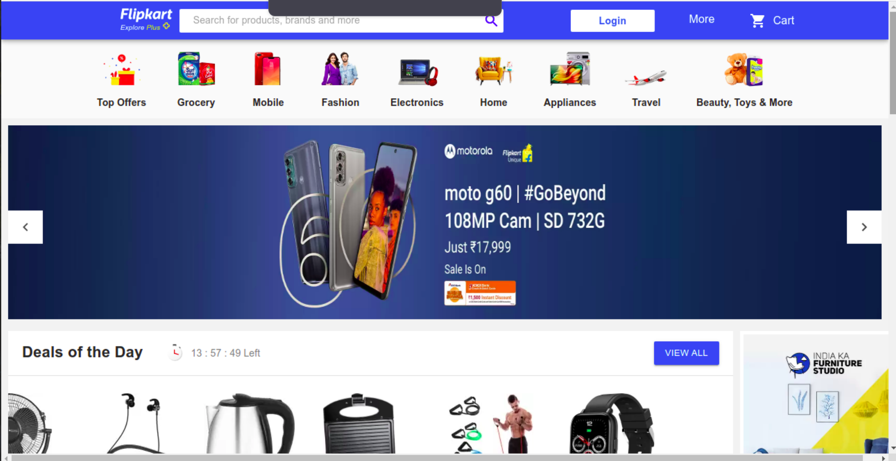
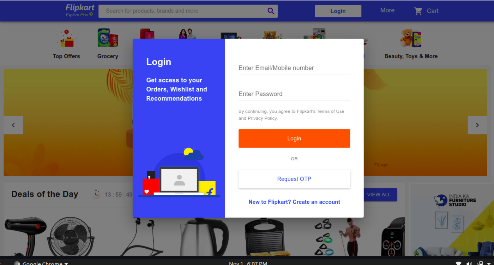
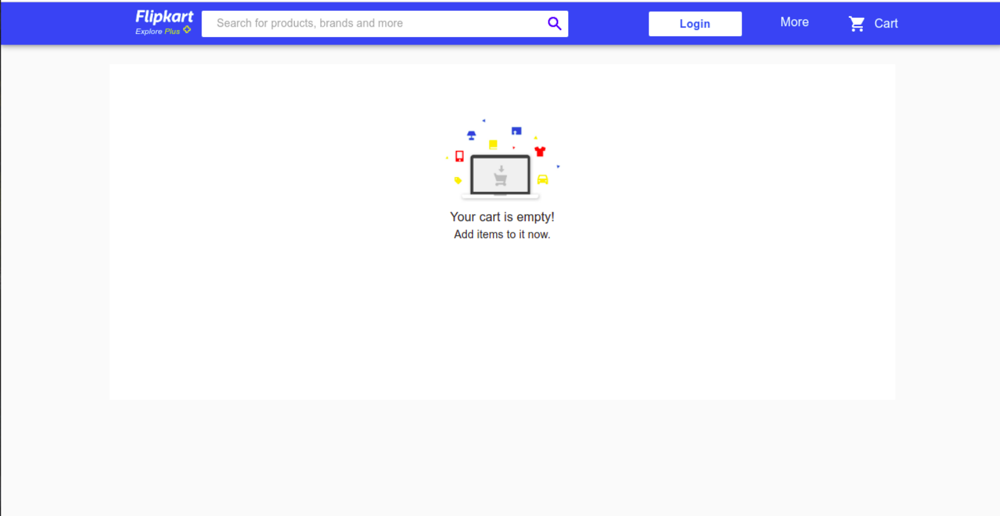
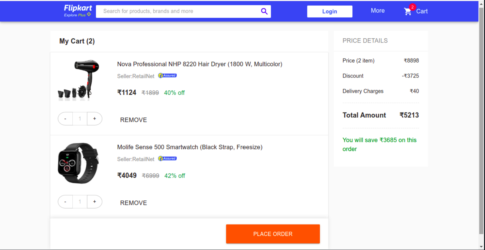

# Flipkar Clone MERN stack

- **Requirements to fork this repo**
  - knowledge of JavaScript
  - React js, redux , redux-thunk , context
  - Knowledge of Express js & MVC architecture
  - Basic knowledge in MongoDB & Mongoose

Flipkart is one of the best and trending eCommerce sites with a presence throughout India. The online shopping website is for Buying and Selling products online within the network.

Flipkart clone is a ready-made remarkable multi-vendor eCommerce site built-in compleatly JavaScript that helps Entrepreneurs can start their own business like Flipkart, which allows the vendors to add products & users to buy the products easily with just a click.

## Tech Stack

- **MERN STACK**
- **React js , Node js , MongoDB , Express js**
- **Materiel UI**
- **RazorPay integration**

## Installation

1. Clone/Download the repo.
2. Run npm install on client as well as server.
3. Add mongo db connection string in server -> db.js
4. Run npm start both server and client to spin the up the local dev server port 8000,3000,(http://localhost:8000),(http://localhost:3000).
